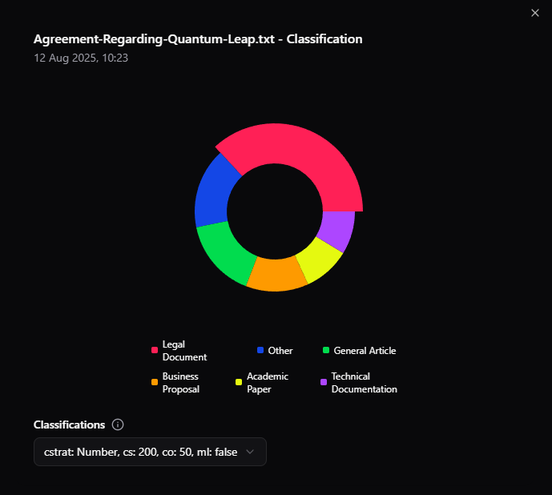
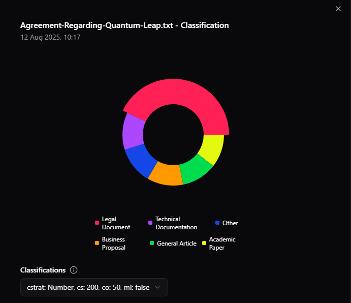

# Classifyinator3000

The **Classifyinator3000**, is here!! A powerful tool for document classification supporting Word, PDF, and TXT files. This project provides a client interface and an API to upload documents, classify their content using zero-shot classification, and incorporate human-in-the-loop feedback for improved accuracy.

[Youtube Video Demo!](https://youtu.be/Fv563-167is)

## 📦 Installation

### Client Installation

1. **Clone the Repository**

   ```bash
   git clone https://github.com/JamieBliss/classifyinator3000
   cd classifyinator3000/client
   ```

2. **Install Dependencies**  
   Ensure you have Node.js installed. Then, install the required packages:

   ```bash
   npm install
   ```

3. **Run the Client**  
   Start the client application:
   ```bash
   npm run dev
   ```
   The client will be available at `http://localhost:3000` (or another port if configured).

### API Installation

1. **Navigate to the API Directory**

   ```bash
   cd classifyinator3000/api
   ```

2. **Set Up a Virtual Environment** (recommended)

   ```bash
   python -m venv venv
   source venv/bin/activate  # On Windows: venv\Scripts\activate
   ```

3. **Install Dependencies**  
   Install the required Python packages:

   ```bash
   pip install -r requirements.txt
   ```

   You may need to install libmagic if you don't already, this is used to detect mimetypes and instructions to install for all OS's can be found [here](https://pypi.org/project/python-magic/)

4. **Run the API**  
   Start the API server:
   ```bash
   fastapi run main.py
   ```
   The API will be available at `http://localhost:8000` (or your configured port).
   Please note that the first process query will take longer as it is downloading the model

## 📤 Document Uploads

The **Classifyinator3000** client provides a user-friendly interface for uploading documents in **Word (.docx)**, **PDF**, and **TXT** formats. Users can either drag and drop or open a filtered file explorer and select the document, ensuring only allowed files are uploaded.

- **Implementation Details**:
  - **Word Documents**: The system uses the `python-docx` library to extract text from `.docx` files, preserving formatting where necessary.
  - **PDF Files**: The `PyPDF2` library extracts text from PDF documents, handling multi-page documents efficiently.
  - **TXT Files**: Plain text files are read directly, with UTF-8 encoding support for compatibility.
  - Files are sent to the API via a POST request, where they are processed and classified.

## 🧠 Document Classification

The core of **Classifyinator3000** lies in its document classification system, powered by the `facebook/bart-large-mnli` model from Hugging Face.

### Classification Process

To handle large documents efficiently, the system implements **text chunking** in two different strategies:

- **By Paragraph** - Chunk the files based on two new line characters
- **By Number of words** - Use the provided limit of words to chunk the text and allow an overlap to be defined

#### Process

- **Chunking**: Large documents are split into smaller chunks based on the strategy selected (We use 200 tokens as a default to ensure compatibility with the model’s input limits). This ensures memory efficiency and prevents truncation of long texts.
- **Classification**: Each chunk is processed by the model, which performs zero-shot classification. The model outputs a confidence score for each possible label.
- **Weighted Averages**: To compute an overall classification for the document, the system calculates a weighted average of the chunk classifications. The confidence score for each chunk is multiplied by the chunk’s length (in tokens or characters) to account for the chunk’s contribution to the document. The formula is:
  ```
  Chunk Weight = Length of Chunk
  Weighted Score = Σ (Chunk Confidence × Chunk Weight) / Σ Chunk Weight
  ```
  This approach ensures longer chunks have a proportional impact on the final classification, improving accuracy for heterogeneous documents and when using paragraphs to chunk.

## Summary of Models Chosen

### `facebook/bart-large-mnli`

- **Pretraining**: Trained on the Multi-Genre Natural Language Inference (MNLI) dataset, it excels at understanding entailment, contradiction, and neutral relationships, making it versatile for classifying diverse texts.
- **Performance**: It balances speed and accuracy, with a large enough architecture (400M parameters) to handle complex texts but remains computationally feasible for API deployment.

### `MoritzLaurer/DeBERTa-v3-large-mnli-fever-anli-ling-wanli`

- **Pretraining** - The model is based on DeBERTa-v3-large using MNLI, Fever-NLI (Face Extraction and VERification), ANLI (Adversarial Natural Language Inference), LingNLI (Linguistic Natural Language Inference), and WANLI (Weakly Aligned Natural Language Inference) datasets with 885,242 NLI hypothesis-premise pairs to fine tune the model.
- **Performance**: A high-performing model (435M parameters) with superior accuracy on some tasks. However, its computational requirements are large so we will see if the extra parameters and longer process will pay off with better results.

### `knowledgator/comprehend_it-base`

- **Pretraining**: Based on DeBERTaV3-base, was pre-trained on natural language inference (NLI) datasets and multiple text classification datasets (not specified)
- **Performance**: The smallest model, 184m parameters. Chosen for it's claimed 'better quality on the diverse set of text classification datasets in a zero-shot setting than Bart-large-mnli while being almost 3 times smaller'. It shows impressive scores over different classification datasets like IMBD, AG_NEWS and Emotions, making it an interesting choice to see if more parameters is always better.

## Classification Results

### File 'Agreement-Regarding-Quantum-Leap.txt' - Parameters Chunking-Strategy: Number of tokens, chunk size: 200, overlap: 50, multi label: False

I choose this document as it was the largest of the .txt documents (11.2kb) and would set a good benchmark on time taken and result quality for bigger documents. I wanted to set an upper bound to find a balance between speed and results.

`facebook/bart-large-mnli` - Took 1 minute and 35 seconds to classify the document as `Legal Document` with 37% confidence, `Other` 16%, `Technical Documentation` 8%



`MoritzLaurer/DeBERTa-v3-large-mnli-fever-anli-ling-wanli` - Took 26 minutes 2 seconds!! to classify the document as `Legal Document` with 42% confidence and `Technical Documentation` 19%



`knowledgator/comprehend_it-base` - Took 36 seconds and classified the document as `Legal Document` like the others with 32% confidence, `Other` 19.9%, `Technical Documentation` 19.3%


`Bart-large-mnli` produced a reasonable result and classified the document as `Legal Document` correctly, interestingly `Other` (16%) was the next biggest score with `Technical Documentation` (8%) as the last. From my perspective this document details complex and technical topics as part of the agreement and I would've thought it would be a bigger slice of the pie. Next, we see `DeBERTA-v3-large` classify the document with only 2% extra confidence than `BART-large-mnli`, and we see `Technical Documentation` as the second largest (19%). However this took far too long, this is partially due to the restrictions of my machine, and the chunking sizes, but in any case this won't cut it from a user perspective especially when the results aren't much better. Finally `comprehend_it-base` was by far the quickest, still classified the document correctly although with less confidence than the others. Nevertheless, I think it did a far better job with scoring the other labels, `Other` was the next largest with 19.9%, then `Technical Documentation` with 19.3%. For the speed, it did a reasonable classification in my eyes.

### File 'A Collection of Life.txt' - Parameters Chunking-Strategy: Number of tokens, chunk size: 200, overlap: 50, multi label: False

`facebook/bart-large-mnli` - Took 12 seconds to classify the document as `Other` with 57% confidence and `General Article` 18%


`MoritzLaurer/DeBERTa-v3-large-mnli-fever-anli-ling-wanli` - 1 minute and 45 seconds to classify it as `General Article` with 91% confidence and `Other` 5%


`knowledgator/comprehend_it-base` - Took 4 seconds and classified the document as `General Article` with 44% confidence and `Other` 43%


This document is interesting as it is a Haiku about viewing life as an interwoven story so I would hope that `Other` and `General Article` would score high. For `bart-large-mnli` we see it was sure it was `Other` and gave `General Article` the next highest ranking, a reasonable result. `comprehend_it-base` gave a similar result but swapped `Other` for `General Article` with a 44% confidence although that was tightly followed by `Other` with 43%. Another reasonable result especially considering how small the other categories were. Finally `DeBERTA-v3-large` gives us a whopping 91% confidence in `General Article`, although it did take significantly longer (again) than the others. I am also unsure if this is the best classification as it fits more into the `Other` category for me than `General Article`.

### Model Selection Summary: Why `facebook/bart-large-mnli`?

The `facebook/bart-large-mnli` model was chosen for its good performance and results, however this was a close due to the speed of `knowledgator/comprehend_it-base` and how the results were very similar to `facebook/bart-large-mnli` even though it is almost 3 times as small. An impressive model. A future feature would be to add model selection in the UI so the user could run the classifications multiple times with different models and choose the best results accordingly. `MoritzLaurer/DeBERTa-v3-large-mnli-fever-anli-ling-wanli` took far too long and the results often weren't quite as good as you would hope for a large model. Admittedly, there are several factors that play into this and tuning the way we chunk the data could have improved results. In order to not end up writing a small paper on this I will base my choice on the results above and the other undocumented tests I ran during the development process. I choose `facebook/bart-large-mnli` as I put more weight on the quality of the results than the speed. If this application was more focused on speed `knowledgator/comprehend_it-base` would be the clear winner.

### Human-in-the-Loop System

To address low-confidence classifications I implemented a `human-in-the-loop` system. The UI provides several ways to visualise confidence, on the table below you can see colour coded classification scores, with green being the best and red the worst.


If the user clicks a row a dialog will open displaynig graphs of all the results for that classification. Examples of these graphs can be found in the previous section.

Additionally, the user is able to re-process the file and set the parameters for the classification themselves. This allows the user to make their own judgements and help reduce the amount of low-confidence scores.

## 🚀 Possible Improvements

With additional time, the following enhancements could further improve **Classifyinator3000**:

- **Multiple File Uploads**: Enable users to upload multiple documents simultaneously via the client interface. This would require batch processing on the API side to handle multiple files efficiently, potentially using asynchronous processing and queues to maintain performance.
- **Parallel Processing**: Optimize the API to process document chunks in parallel, reducing classification time for large files.
- **Manual Classification Override**: Allow users to manually choose the best classification from a list of predicted labels, even for high-confidence results. This could be implemented as a dropdown or radio button selection in the client UI, giving users more control, improving accuracy for domain-specific documents.
- **Support for Additional Formats**: Add support for other file types, such as Markdown or HTML, to broaden the tool’s applicability.
- **API - Testing**: As this is in an early development stage testing has been omitted to allow faster prototyping and completion of features. Before shipping to production there would need to be unit-testing for the api-endpoints. Which would help improve maintainability and reliability.
